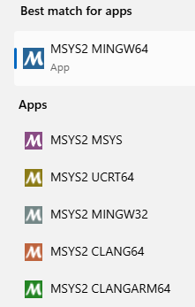

# gtkwave-pack

The script (**build_gtkwave_pkg.sh**) packs the result of **Meson** build on **MSYS2** on Windows of the latest gtkwave sources from https://github.com/gtkwave/gtkwave. The script puts all the necessary dlls and executables into a zip archive and adds a **launcher script** to start the executable (by setting correct paths first). When distributed, the archive can be unpacked on a windows system and launch.bat can be double clicked to start the waveform viewer.
* *Remark: Windows (11) seems to be able to find lib and share folders on its own (without launcher script). Initially I thought it was needed because of* https://github.com/YosysHQ/oss-cad-suite-build/blob/main/default/patches/environment.bat .
*So one can also start the waveform viewer by just double clicking on the gktwave.exe.*

**Detailed instructions** (commands are also in build.txt):

* install msys2 via https://www.msys2.org
* open MSYS2-**MINGW64** terminal
* execute pacman commands below in that terminal (first command should be executed twice.)



```
pacman -Syuu
pacman -Syuu
pacman -S mingw-w64-x86_64-gcc base-devel mingw-w64-x86_64-tk
pacman -S mingw-w64-x86_64-gtk3 mingw-w64-x86_64-gperf git
pacman -S mingw-w64-x86_64-meson
pacman -S mingw-w64-x86_64-gtk4
pacman -S mingw-w64-x86_64-gobject-introspection
pacman -S mingw-w64-x86_64-desktop-file-utils

cd git
git clone https://github.com/gtkwave/gtkwave.git
cd gtkwave

meson setup build --prefix=/opt
meson compile -C build

cd ..
git clone https://github.com/marceloosterhuis/gtkwave-pack.git
cd gtkwave-pack
./build_gtkwave_pkg.sh
```

info@oosterhuis.net
