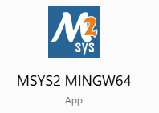

# gtkwave-pack

The script packs the result of meson build on MSYS2 on Windows of the latest gtkwave sources from github. The script puts all the necessary dlls and executables into a zip archive and add a launcher script to start the executable (by setting correct paths first). When distributed, the archive can be unpacked on a windows system and launch.bat can be double clicked to start the waveform viewer.

https://github.com/gtkwave/gtkwave



build.txt:
```
pacman -Syuu
pacman -Syuu
pacman -S mingw-w64-x86_64-gcc base-devel mingw-w64-x86_64-tk
pacman -S mingw-w64-x86_64-gtk3 mingw-w64-x86_64-gperf git
pacman -S mingw-w64-x86_64-meson
pacman -S mingw-w64-x86_64-gtk4
pacman -S mingw-w64-x86_64-gobject-introspection
pacman -S mingw-w64-x86_64-desktop-file-utils

cd git
git clone https://github.com/gtkwave/gtkwave/ gtkwave
cd gtkwave

meson setup build --prefix=/opt
meson compile -C build

cd ..
git clone git@github.com:marceloosterhuis/gtkwave-pack.git
cd gtkwave-pack
./build_gtkwave_pkg.sh
```
